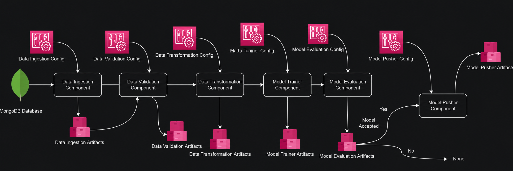
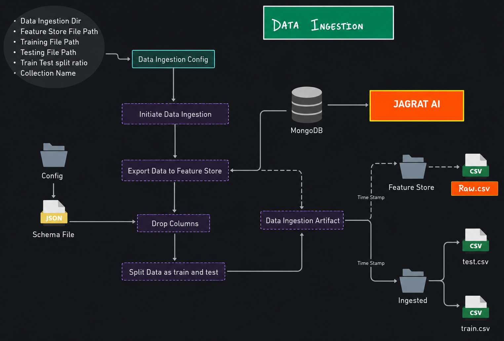
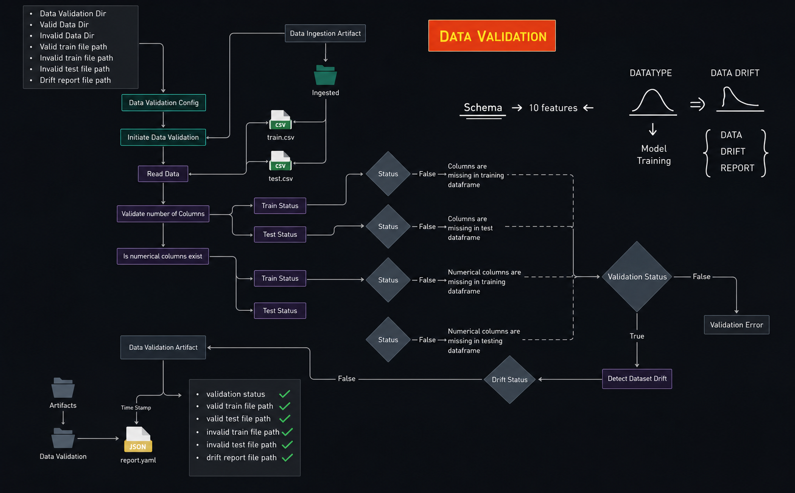
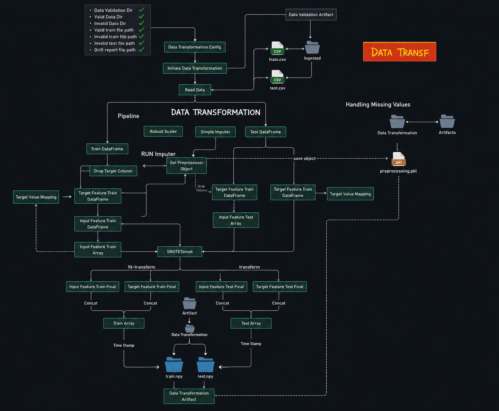
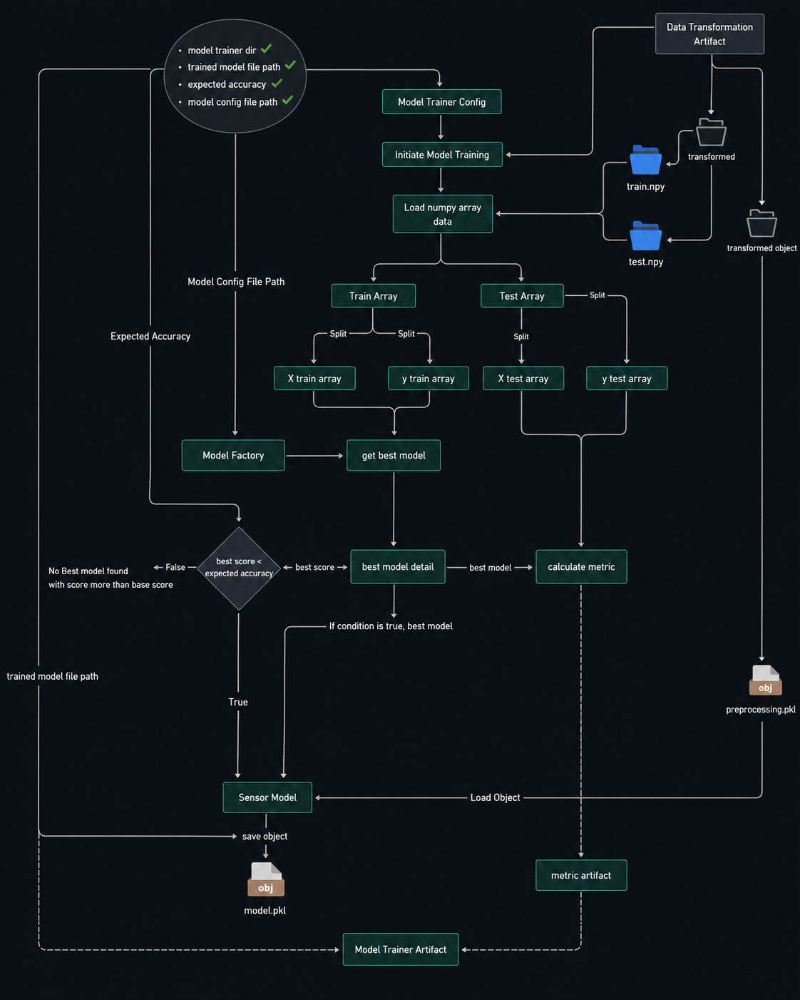

## Chapter 1: Introduction

This project is a Python-based network security machine learning pipeline for detecting phishing websites from network data. It combines data ingestion, validation, transformation, and model training into a repeatable pipeline that reads data from MongoDB, validates schema and drift, preprocesses features, trains multiple classifiers, and saves a production-ready model.

The repository includes:
- A data ingestion pipeline that exports MongoDB collections to local CSV files and splits them into training and test sets.
- Data validation logic that checks schema integrity and detects dataset drift using statistical tests.
- Data transformation with KNN imputation and preprocessing pipeline creation.
- Model training with multiple classification algorithms, hyperparameter search, and MLflow/Dagshub tracking.
- Support utilities for model persistence, artifact management, and environment configuration.

This README documents the project features, architecture, and how to run the project locally.

## Chapter 2: All Features

### Core Pipeline Features
- `main.py`: The central entry point for the pipeline. It runs data ingestion, validation, transformation, and model training in sequence.
- `networksecurity/components/data_ingestion.py`: Reads phishing data from MongoDB, saves a feature store CSV, and performs train/test splitting.
- `networksecurity/components/data_validation.py`: Verifies that incoming data matches the schema defined in `data_schema/schema.yaml` and detects distribution drift between training and testing splits.
- `networksecurity/components/data_transformation.py`: Applies KNN imputation to missing values and creates a preprocessor object, storing transformed NumPy arrays and a preprocessing artifact.
- `networksecurity/components/model_trainer.py`: Trains multiple classifiers (Random Forest, Decision Tree, Gradient Boosting, Logistic Regression, AdaBoost), performs hyperparameter search, and saves the best model.

### Data and Schema Management
- `data_schema/schema.yaml`: Defines feature names and data types for the phishing dataset and serves as the validation schema.
- `Network_Data/phisingData.csv`: The sample phishing dataset used for ingestion and training.
- `push_data.py`: Converts CSV records to JSON and uploads them into MongoDB.
- `test_mongodb.py`: A simple connectivity verification script for MongoDB.

### Machine Learning and Tracking
- Uses `scikit-learn` for preprocessing, model training, and evaluation.
- Evaluates classification performance with F1 score, precision, and recall.
- Tracks experiments using MLflow and Dagshub, with the tracking URI configured in `networksecurity/components/model_trainer.py`.
- Saves final artifacts under `final_model/`, including `model.pkl` and `preprocessor.pkl`.

### Utility and Configuration
- `networksecurity/entity/config_entity.py`: Builds configuration paths for all pipeline stages and artifact directories.
- `networksecurity/entity/artifact_entity.py`: Defines dataclasses for pipeline artifacts.
- `networksecurity/utils/main_utils/utils.py`: Handles YAML reading/writing, NumPy persistence, object serialization, and model evaluation.
- `networksecurity/logging/logger.py`: Configures logging for the pipeline and writes logs into a timestamped `logs/` directory.

### Environment and Containerization
- `requirements.txt`: Lists project dependencies such as `pandas`, `numpy`, `pymongo`, `scikit-learn`, `mlflow`, `fastapi`, and `uvicorn`.
- `Dockerfile`: Available for containerizing the application if desired.

## Chapter 3: System Architecture

The system architecture is organized as a modular pipeline with clearly separated stages: ingestion, validation, transformation, and training. Below are the architecture diagrams included in the `system-archietecture/` folder.

### 1. Project Structure


### 2. Data Ingestion


### 3. Data Validation


### 4. Data Transformation


### 5. Model Trainer


### Architecture Overview
- Data is loaded from MongoDB using `pymongo` and optionally ingested from `Network_Data/phisingData.csv` using `push_data.py`.
- `DataIngestion` exports the collection to CSV, stores a feature store, and writes train/test files.
- `DataValidation` checks dataset schema and drift, producing validated train/test artifacts.
- `DataTransformation` builds a KNN imputer pipeline and saves transformed NumPy arrays and preprocessor state.
- `ModelTrainer` evaluates several classifiers with hyperparameter tuning and persists the best performing model.

## Chapter 6: How to Run the Project Locally

### Prerequisites
- Python 3.8 or newer
- MongoDB accessible via connection URL
- Git clone of this repository
- `.env` file with `MONGO_DB_URL` configured

### Install Dependencies
```bash
python -m pip install --upgrade pip
pip install -r requirements.txt
```

### Configure Environment
Create a `.env` file in the repository root with:
```env
MONGO_DB_URL=<your_mongodb_connection_string>
```

### Load Data into MongoDB
If you want to ingest the `Network_Data/phisingData.csv` dataset into MongoDB, run:
```bash
python push_data.py
```
This converts the CSV into JSON records and inserts them into the configured database and collection.

### Verify MongoDB Connection
```bash
python test_mongodb.py
```

### Run the Pipeline
```bash
python main.py
```

### Review Output
- Trained and test CSV artifacts are created under `Artifacts/<timestamp>/data_ingestion/`.
- Validated data and drift reports appear under `Artifacts/<timestamp>/data_validation/`.
- Transformed arrays and preprocessing object are saved under `Artifacts/<timestamp>/data_transformation/`.
- Final trained model is saved under `final_model/model.pkl` and preprocessing model under `final_model/preprocessor.pkl`.
- Logs are written to `logs/<timestamp>.log`.

### Optional Docker Workflow
The project includes a `Dockerfile` for containerized deployment. Build and run the image with Docker if you want to isolate dependencies.

### Deployment

```bash
Setup github secrets:
AWS_ACCESS_KEY_ID=

AWS_SECRET_ACCESS_KEY=

AWS_REGION = us-east-1

AWS_ECR_LOGIN_URI = 788614365622.dkr.ecr.us-east-1.amazonaws.com/networkssecurity
ECR_REPOSITORY_NAME = networkssecurity


Docker Setup In EC2 commands to be Executed
#optinal

sudo apt-get update -y

sudo apt-get upgrade

#required

curl -fsSL https://get.docker.com -o get-docker.sh

sudo sh get-docker.sh

sudo usermod -aG docker ubuntu

newgrp docker
```

## Chapter 7: Conclusion

This project demonstrates a complete network security ML workflow for phishing detection. It includes end-to-end data ingestion, validation, transformation, training, evaluation, and artifact persistence.


